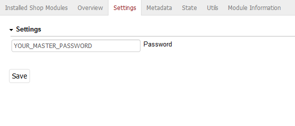

# Oxid master password

## Description

Define a master password which you can use to login in the shop frontend as an user. Helpfull if you like to see the same result as the customer itself.

This extension was created for Oxid 6.x.

## Install

1. Add following to composer.json on the shop root

        "autoload": {
            "psr-4": {
                "rs\\masterpassword\\": "./source/modules/rs/masterpassword"
            }
        },
    
2. Refresh autoloader files with composer.

        composer dump-autoload
        
3. Enable module in the oxid admin area, Extensions => Modules
4. Changes settings in the module itself

